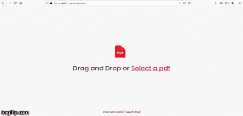

# PDF2POD



PDF2POD is a PDF file reader that takes any pdf document, converts it to text and reads the text aloud.

You can see a live demo [here](http://pdf-2-pod.netlify.com). The article that explains the design process can be found [here](http://www.slightlynerd.com/journal/1561984220383/voice-enabled-web-apps--introduction-to-the-speech-synthesis-api).

## Installation

* Clone the repo - ```git clone http://github.com/slightlynerd/pdf-2-pod```
* ``` cd pdf-2-pod ```
* ``` npm install ```

## Start development server

* ``` npm run dev ```

## Build for production

* ``` npm run build ```

## License

[MIT](LICENSE.md)